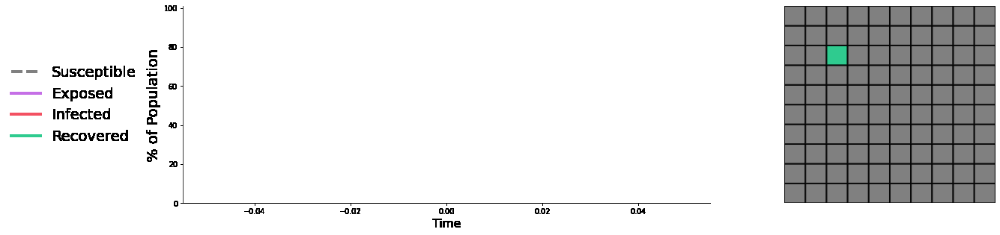

# Analysis_SEIR_model

This project is the framework for modelling a compartmental model and creating an animated output.

#### Launching a new Environment
The following command will launch an environment with the relevant dependencies:
```
conda env create -f environment.yml -n seir
```
Once created the new environment can be activated and deactivated using the following commands:
```
source activate seir
source deactivate
```
The final command will launch a new intsance of iPython Notebooks in the environment:
```
jupyter notebook
```
To remove the environment after deactivation run the following:
```
conda env remove -n seir
```

#### Running the SEIR model
In the folder **notebooks/** is an analysis notebook which walks through calling the Python class and passing parameters to the model.
```
o = seir.SEIR_modelling(N=100)
o.SEIR_solver()
```
Basic plotting can be called on any frame of the time iteration value (i). Using the `save=` parameter allows the figure to be stored to the appropriate location:
```
o.plot_model(i, save='../fig/output/seir_model.png')
```
An animated gif of the model can also be produced by calling the following command. The parameter `skip_frames` can be used to reduce the filesize of the output. The final gif will save into **fig/output/**:
```
o.plot_animation(skip_frames=True)
```
An example of the animated output is shown below:
<p align="center">
	
</p>